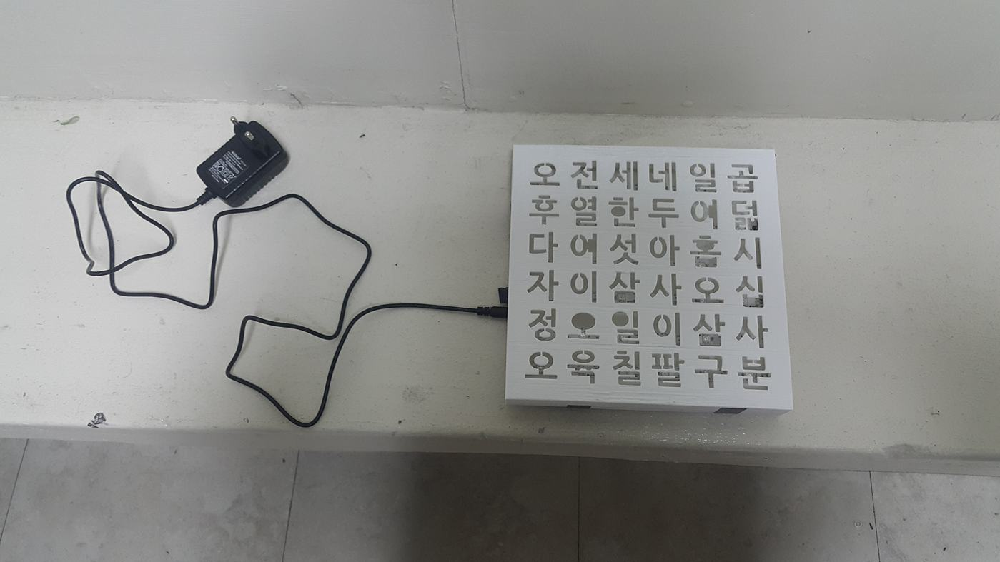
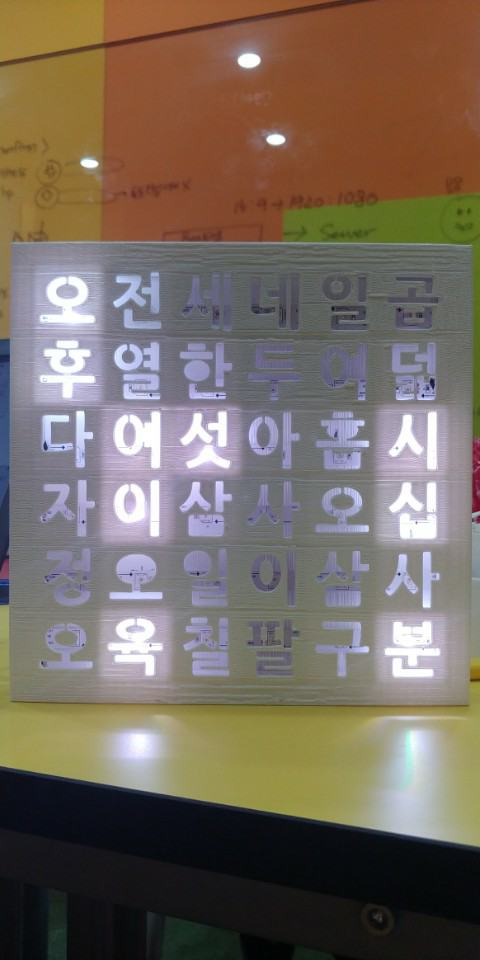

# 2018_Arduino_Hangeul_Clock

## 아두이노 한글 시계

 

 

## 기술 스택

| arduino |
| :--------: |
|      |

 

## 후기

- 한 번 쯤은 만들고 싶었던 한글 시계
- LED가 생각보다 강했고, 실물이 생각보다 예뻤다

 

## 라이센스

MIT &copy; [ITJEONG](mailto:derbana1027@gmail.com)
